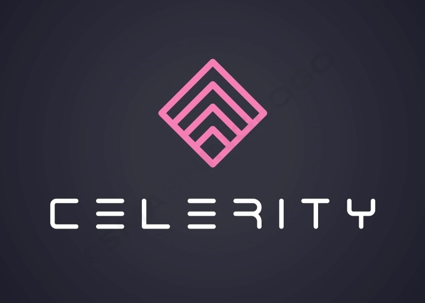

<link rel="shortcut icon" type="image/x-icon" href="favicon.ico">

 

### ***[Contact](mailto:b.evans@skyhighfund.com) &nbsp;-&nbsp; [Send idea o pitch](mailto:b.evans@skyhighfund.com) &nbsp;-&nbsp; [Twitter](https://twitter.com/brianevans_)***

## Startup Accelerator | Business Innovation
***
**Finance:**
- Raising capital - F&F, seed, series A-D rounds
- Capital structuring - SAFE, bridge round, convertibles
- Absolute valuation - DCF+TV/NPV, discount rate/WACC
- Relative valuation - comparables, recent transactions
- Cap table design and development
- Term sheet - economics and control
- Dividend policy, preferred/common equity
- Equity issuance, placement and re-purchase
- ESOP, equity compensation, vesting
- Liquidity events - M&A, IPO
- Due diligence
- Lead investor advisory
- Funding/VC/PE readiness 
- Board of directors configuration

**Data Science:**
- Python - Pandas, Seaborn, Scikit, Keras, TensorFlow
- Unsupervised learning (find patterns)
- Supervised learning (predict values and classification)
- Semi-supervised learning (incomplete values or classes for target)
- Reinforcement learning (multi-stage decision making)
- Interactive dashboards 
- Board deck design
