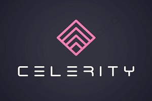

<link rel="shortcut icon" type="image/x-icon" href="favicon.ico">
<!-- Primary Meta Tags -->
<meta name="title" content="CELERITY | Startup Accelerator">
<meta name="description" content="Startup Accelerator">

<!-- Open Graph / Facebook -->
<meta property="og:type" content="website">
<meta property="og:url" content="https://celerityventures.github.io/">
<meta property="og:title" content="CELERITY | Startup Accelerator">
<meta property="og:description" content="Startup Accelerator">
<meta property="og:image" content="">

<!-- Twitter -->
<meta property="twitter:card" content="summary_large_image">
<meta property="twitter:url" content="https://celerityventures.github.io/">
<meta property="twitter:title" content="CELERITY | Startup Accelerator">
<meta property="twitter:description" content="Startup Accelerator">
<meta property="twitter:image" content="">

 

### **[Contact](mailto:b.evans@skyhighfund.com) &nbsp;-&nbsp; [Send pitch](mailto:b.evans@skyhighfund.com) &nbsp;-&nbsp; [EN](readme.md)|[ES](readmeesp.md)**

  
  

## Startup Accelerator | Business Innovation
***
**Finance:**
- Raising capital - F&F, seed, series A-D rounds
- Capital structuring - SAFE, bridge round, convertibles
- Absolute valuation - DCF+TV/NPV, discount rate/WACC
- Relative valuation - comparables, recent transactions
- Cap table design and development
- Term sheet - economics and control
- Dividend policy, preferred/common equity
- Equity issuance, placement and re-purchase
- ESOP, equity compensation, vesting
- Liquidity events - M&A, IPO
- Due diligence
- Lead investor advisory
- Funding/VC/PE readiness 
- Board of directors configuration

**Data Science:**
- Python - Pandas, Seaborn, Scikit, Keras, TensorFlow
- Unsupervised learning (find patterns)
- Supervised learning (predict values and classification)
- Semi-supervised learning (missing values for target)
- Reinforcement learning (multi-stage decision making)
- Interactive dashboards 
- Board deck design
