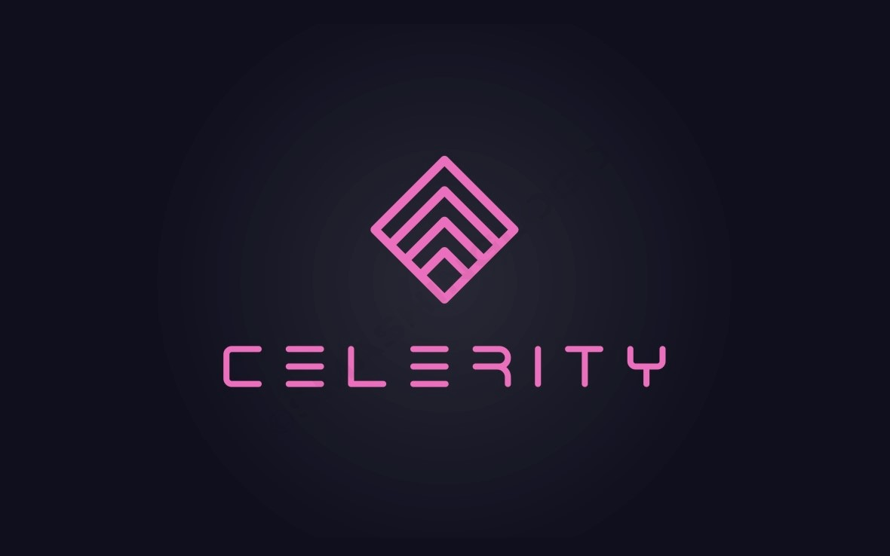

# CELERITY
### ***Finanzas y data science para startups y private capital***

### [Contacto. Comparti tu idea o pitch](mailto:b.evans@skyhighfund.com) 

### [Twitter: @brianevans_](https://twitter.com/brianevans_)

### [About founder](https://github.com/celerityventures/celerityventures.github.io/blob/785313db8efef2f5e8f81d016c1dee7df3273724/CV%20Github.pdf)

.

## Soluciones en 2 areas:

1. Finanzas e inversiones:
- access to capital: bridge rounds, SAFE, conv. notes, F&F, Seed, Series A-D rounds
- absolute valuation - recent transactions, DCF+TV, NPV, discount rate/WACC
- relative valuation - comparables
- cap table design and development
- term sheet: economics and control, investors due diligence
- lead investor advisory
- capital structuring
- dividend policy
- stock issuance, trading and re-purchase
- ESOP, internal equity design
- liquidity events - M&A, IPO
- funding/VC readiness 
- Board of directors configuration and design

2. Data Science:
- Python, Scikit, Pandas
- Unsupervised learning (find patterns)
- Supervised learning (predict numerical value or classification)
- Semi-supervised learning (only part of data has values for, or classification of, target)
- Reinforcement learning (multi-stage decision making)
- Interactive Dashbaords 
- Board deck designs

## Mas de USD 500K de capital invertido en buenas ideas 
