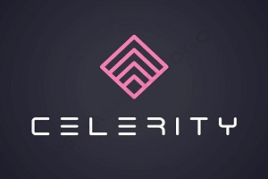

<link rel="shortcut icon" type="image/x-icon" href="favicon.ico">

 

### ***[Contacto](mailto:b.evans@skyhighfund.com) &nbsp;-&nbsp; [Enviar pitch](mailto:b.evans@skyhighfund.com) &nbsp;-&nbsp; [EN](readme.md)|[ES](readmeesp.md)***

  
  

## Aceleradora de Startups | Innovación Empresarial
***
**Finanzas:**
- Levantamiento de capital - F&F, semillas, rondas serie A-D
- Estructuración de capital - SAFE, ronda puente, convertibles
- Valoración absoluta - DCF+TV/VAN, tasa de descuento/WACC
- Valoración relativa - comparables, transacciones recientes
- Diseño y desarrollo de cap table
- Hoja de términos - economía y control
- Política de dividendos, acciones preferentes/comunes
- Emisión, colocación y recompra de acciones
- ESOP, compensación de capital, adquisición de derechos
- Eventos de liquidez - M&A, IPO
- Debida diligencia
- Asesoramiento a inversores líderes
- Preparación para financiación/VC/PE
- Configuración de junta directiva

**Ciencia de los datos:**
- Python: Pandas, Seaborn, Scikit, Keras, TensorFlow
- Aprendizaje no supervisado (encontrar patrones)
- Aprendizaje supervisado (predecir valor numérico o clasificación)
- Aprendizaje semisupervisado (valores o clases incompletos para objetivo)
- Aprendizaje por refuerzo (toma de decisiones en varias etapas)
- Tableros interactivos
- Deck de junta directiva
